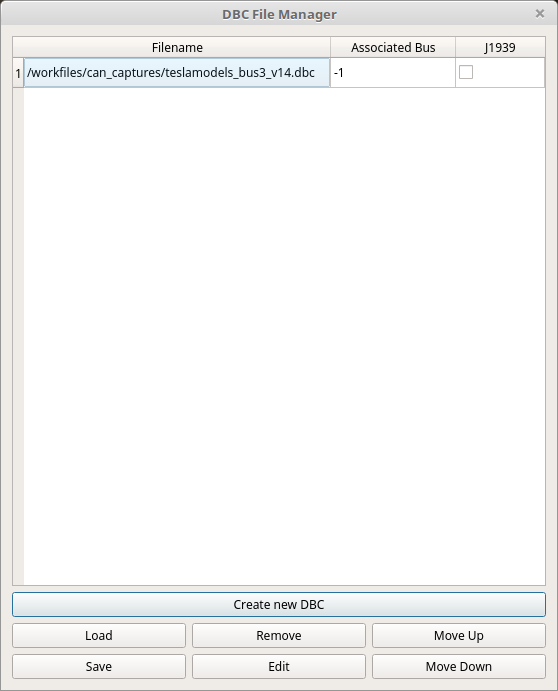

DBC File Manager
=================

Working with DBC Files
=======================

This screen allows you to load and save DBC files. SavvyCAN supports loading more than one DBC file at a time. It can even use more than one DBC file per bus. But, "Associated Bus" can be used to associate a given DBC file to only one bus. If you don't need to associate to any specific bus then set this value to -1 which means "any bus." The J1939 button causes SavvyCAN to mask out J1939 message IDs to conform to J1939 signaling. You can create a brand new DBC file by clicking "Create new DBC" button. It will be automatically named a unique name for you. You probably don't want that name though. Any time you save a DBC file its name will automatically update in the list. The "Load", "Save", "Remove", "Edit" buttons are all straight forward. You can also edit a DBC file by double clicking it in the list. 

DBC File Ordering
===================

The "Move Up" and "Move Down" buttons can be used to change the order of DBC files. Why would you care? DBC files are accessed in the order they are in the list. When a frame is interpreted the system goes through the DBC files in order. It selects the first DBC file that is associated to the bus the message came in on and that implements the correct message ID. So, if you have multiple DBC files it is possible that the order might matter. 
