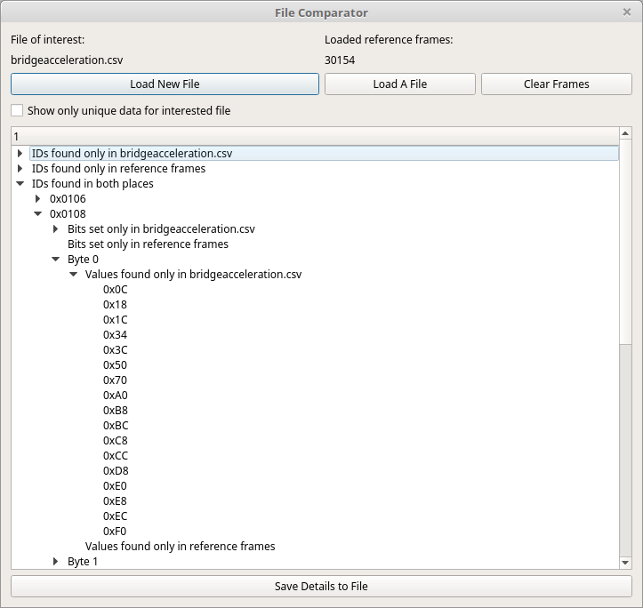

File Comparison Window
========================

The Purpose of the File Comparator
==================================

This screen can be used to figure out what is different between a set of files. On one side you have a single file. This is called the "File of interest". On the other side you have any list of files. They're not listed any longer as actual files. The program can load frames from any number of files and dump them all into the same "bucket" of frames. You can thus load up a batch of files and compare them against the one "File of interest." The purpose of this is to figure out what is different. Are there IDs found only on one side? For IDs found on both sides are there bits set only on one side and not the other? This can be used to find stubborn data that you are having trouble locating. One use is to capture a large amount of traffic to use as "background noise" of sorts. Perhaps drive around for a long time or let the vehicle idle for some time but never do the thing you need to find. Then do another capture and do the thing you're missing a few times. Perhaps you're looking for a gear shift signal. You could capture a large batch of frames while idling. Then, in a second capture shift several times. Now, compare the two. Somewhere in the differences should be the gear selection you couldn't find. The list ought to be much more narrow than just "shooting in the dark" so to speak.

The layout of the differences list
==================================

In the differences list you'll find three main tree nodes:

1. IDs found only in <file of interest>

    * In sub nodes you'll find every ID found only in the file of interest and not in any of the reference files.

2. IDs found only in reference frames

    * In theory this should be a fairly small list. Here are any IDs never seen in the file of interest

3. IDs found in both

    * Here is where the interesting information lies. The sub nodes here are found in both places. A list of all differences will be shown sub nodes of each ID node. Here you can see bits set only in one side or the other. You can also find values only found on one side or the other. These might be candidates for your mystery signal.

