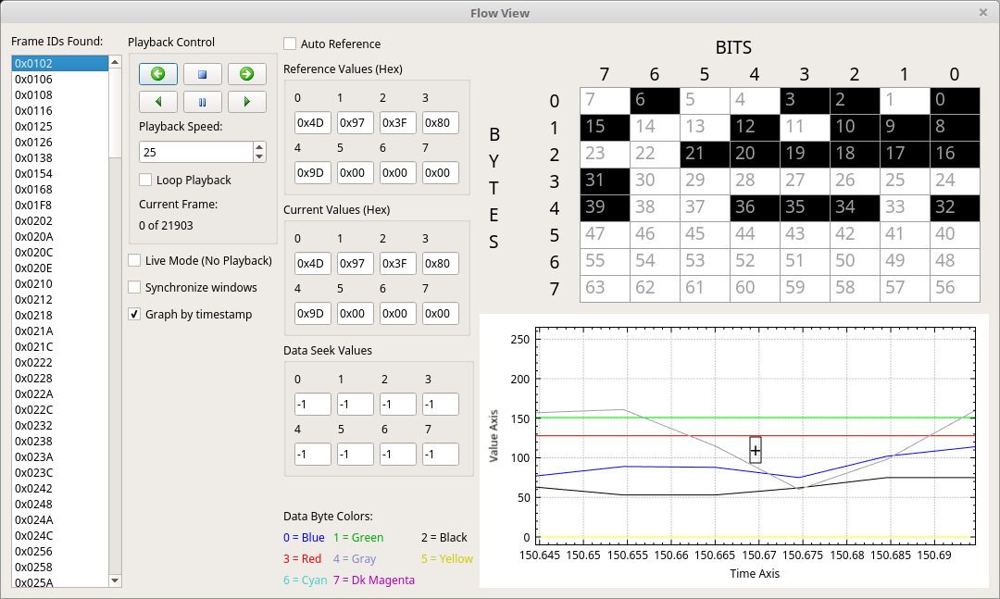

Flow View Window
==================

The Purpose of Flow View
=========================

Flow view is meant to show a view of what "happens to" the data for a given ID as time goes on. The flow is a flow of time or messages going by. The goal is to visualize what is going on as time passes. The screen is very busy but everything has the same goal - to show the data bytes across the list of all frames with that ID.

Selecting an ID to Flow
=======================

Along the left most side of the window is a list of every frame ID captured so far. You can select any of these IDs. Once you select an ID you'll see the number of frames with that ID just to the right of the IDs list (in the bottom of the Playback Control box).

Viewing the Flow
=================

There are a variety of ways that the data bytes for the current frame are displayed. Toward the middle of the window there are 8 text boxes that show the current value of each data byte. At the right of the window are two visualizations. On the top there is an 8x8 grid that visualizes every possible bit in a CAN message. Bits which are white are currently 0 or off. Bits which are black are 1 or on. Bits that are green are newly on in this frame. They were 0/off in the reference. Bits which are red are newly off in this frame. Those bits were 1/on in the reference. 

Below the 8x8 grid view is a graph based view. The "+" in the center marks the "current" time. You can thus see both into the future and the past (relative to the current frame) in this view. All 8 data bytes are graphed according to their value. You can thus see in the graph what the value is doing as time ticks by. 

Between these three views you should have a very good idea of how the data bytes change over time.

Controlling the Flow
=====================

The screen has many ways to control the flow. The "Playback Control" box has 6 icons in a 3x2 grid. The upper icons mean (from left to right): Go back one frame, Stop, Go forward one frame. The bottom icons mean: Play backward, pause, Play forward. Playback speed is used to control how quickly the flow happens. You can raise and lower this value even as the flow is playing back and it will change the flow speed in realtime. You can select "Loop Playback" to keep looping over and over. It is possible to select "0" as the frame interval. This will make the program progress as quickly as it can. This probably will not be much faster than a frame interval of 1 but it will be a bit faster.

Additional control options
===========================

Below the "Playback Control" box is a set of three check boxes. "Live Mode" will cause the flow view to keep the current frame at the latest received frame from the capture hardware. This is thus a "real time" option where the flow will happen in real time as frames come in. "Synchronize windows" causes the flowing in this window to update the position in the main window so that the main window is always at the current position in flow playback. "Graph by timestamp" causes the "Time Axis" at the bottom of the graph view to be in seconds or microseconds. Deselecting this will cause that axis to instead be in frame number.

Reference Values
=================

Previously it was mentioned that bits in the 8x8 grid are colored based on whether they are
newly on/off or steady state compared to the reference. What is the reference? Well, look to the left of the 8x8 grid. The reference values here are used for reference with the 8x8 grid. You can set these values to something static and then see how bits compare to that static reference. Or, above the reference values is a checkbox called "Auto Reference" if this is clicked then the last frame is used as a reference for the current one. There are advantages to both options. A static reference can be used to see how things change compared to, say, the very first frame. Auto reference shows how the data changed from frame to frame. Either might yield interesting findings. The default values for static reference are taken from the values that the first frame has. You are free to change them to any value 0 through 0xFF.

Seeking to Specific Values
===========================

Lastly, it is possible to seek to specific values. "Data Seek Values" normally default to -1. But, if a value other than -1 is found in one of these boxes then it will be used as a seek value. Any time the flow is playing back (either forward or backward) it will compare to the seek values. If there is a match then playback will automatically stop. This can be used to quickly play things back until you get to a specific value. One use would be to seek to a known value that precedes an important section you want to analyze in more depth. Also, in this same vein, if you click in the 8x8 grid of bits you will see that the cell you clicked on has the text turn blue and become bold. Any bit that you've selected this way will also act as a way to stop playback. If that bit changes, either being set or unset, then playback will stop. Click the cell again to deselect it.
